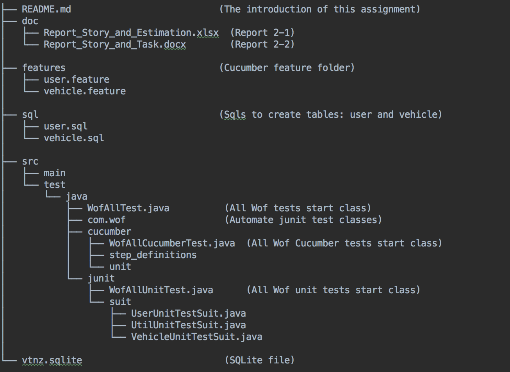

##WofInspectSystem

### 1, Project Structure

                     
### 2, Test Structure (Workflow)

Note: These test suit class support a quick way to cover all tests or special test requirements, 
         developer can build flexible test combination.
         

### 3, How to run this project
   3-1 Use Intellj IDEA to open this project, every config will auto loaded
       if this project does not work, please check the module config, make sure all related libs
       has imported. eg, check cucumber and sqlite-jdbc-3.21.0.1.jar

### 4, How to test
4-1 Cucumber test

+ All cucumber test
  <pre><code>Run ~/WofInspectSystem/src/test/java/cucumber/WofAllCucumberTest.java</code></pre>
+ Owner subscription cucumber test 
  <pre><code>Run ~/WofInspectSystem/src/test/java/cucumber/unit/UserCucumberTest.java </code></pre>
+ Vehicle subscription cucumber test
  *Note: before you run this test, you must make sure this user has registered in the system*
  <pre><code>Run ~/WofInspectSystem/src/test/java/cucumber/unit/VehicleCucumberTest.java</code></pre>
       
       
4-2 Junit test

+ All unit tests
  <pre><code>Run ~/WofInspectSystem/src/test/java/junit/WofAllUnitTest.java</code></pre>
+ Owner subscription related unit tests
  <pre><code>Run ~/WofInspectSystem/src/test/java/junit/suit/UserUnitTestSuit.java</code></pre>
+ Vehicle subscription related unit tests
  <pre><code>Run  ~/WofInspectSystem/src/test/java/junit/suit/VehicleUnitTestSuit.java </code></pre>
+ Single unit test
  <pre><code>Run the classes in path: ~/WofInspectSystem/src/test/java/com/wof/*.java </code></pre>
       
4-3 All Wof test (cover all cucumber tests and all unit tests)
    <pre><code>Run ~/WofInspectSystem/src/test/java/WofAllTest.java</code></pre>
   
### 5, Document
1.  [Wof Inspect System: Story and Task](https://docs.google.com/document/d/12RZ2Oibaw8qnJzjB_lEdYx7gH18RSWkDtTosyb2WQCQ/edit?usp=sharing)
2.  [WOF Inspect System: Story_and_Estimation](https://docs.google.com/spreadsheets/d/1VM-p7sD8_MyDD7MwDLwvtuozmtMGpIIsOrnyJIAU720/edit?usp=sharing) 
 
### 6, FAQ
1. If you found some strange problems, please restart the Intellj IDE
   
2. If there are any problems make sqlite db does not work, please use these methods to reset data
   + cd to project root path, eg ~/WofInspectSystem
   + create sqlite file by "sqlite3 vtnz.sqlite", and then you are in command line mode
   + in command line mode, create table user by sql sentence stored in ~/WofInspectSystem/sql/user.sql
   + in command line mode, create table vehicle by sql sentence stored in ~/WofInspectSystem/sql/vehicle.sql